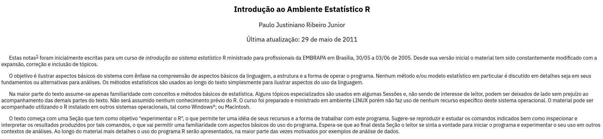

```{r, cache=FALSE, include=FALSE}
source("setup/setup_knitr.R")
```

# Slides disponíveis em

.msmall[
- HTML: http://leg.ufpr.br/~fernandomayer/rufpr
- PDF: http://leg.ufpr.br/~fernandomayer/rufpr/rufpr.pdf
- Código-fonte: https://github.com/leg-ufpr/rufpr
]

```{r, echo=FALSE, out.width='50%'}

```

<!-- # Tópicos -->

<!-- (Por enquanto, UFPR = DEST) -->

<!-- - Início do R na UFPR (~ 2000?) -->
<!--   - Vinda do PJ da Inglaterra -->
<!--   - Capacitação de professores do DEST -->
<!--   - Apostila Rembrapa -->
<!--   - Implementação da infra-estrutura computacional (parceria com C3SL) -->
<!--   - Lista R_STAT -->
<!--   - Lista R-br -->
<!--   - Falar como era antes?? -->

<!-- - Disciplinas sobre R na graduação em Estatística (currículo antigo) -->
<!-- - Disciplinas sobre R na graduação em Estatística (currículo novo) -->
<!--   - Estatística Computacional I (listar tópicos) -->
<!--   - Estatística Computacional II (listar tópicos) -->
<!-- - Demais disciplinas onde o R é *fortemente* utilizado -->
<!--   - Regressão, GLM, extensões, bayesiana, CPI, etc -->
<!-- - Infraestrutura computacional atual -->
<!--   - Laboratórios (DEST e DINF) -->
<!--   - OpenSLX -->
<!-- - Materiais atuais -->
<!--   - Apostila ECR -->
<!--   - PRR -->
<!--   - Juntar mais materiais (específicos ou gerais) -->

<!-- - Se for falar do R na UFPR (no geral) -->
<!--   - Mencionar grupos que sabemos que usam? (Economia, ecologia, CEM, -->
<!--     etc) - já faria o gancho para as próximas apresentações -->
<!--   - O que mais? -->

---
# Origens do R no DEST/UFPR

DEST adota o R como linguagem de programação para ensino de
Estatística **desde 2002**

- Paulo Justiniano retorna do doutorado na Inglaterra (2002)
  - Capacitação de professores do DEST
  - Inclusão de disciplinas específicas no curso de graduação em
    Estatística
  - Apostila Rembrapa (2005)
  - Infraestrutura computacional
     - Migração de Windows para Linux em terminais

- UFPR foi o primeiro espelho do CRAN (*Comprehensive R
Archive Network*) na **América do Sul** (via C3SL -
http://cran-r.c3sl.ufpr.br)

---
# Origens do R no DEST/UFPR

Apostila Rembrapa (2005) - "Introdução ao ambiente estatístico R"
http://www.leg.ufpr.br/~paulojus/embrapa/Rembrapa/

<!-- <br> -->

```{r, echo=FALSE, out.width='100%', fig.align='center', include=FALSE}

```

.small[
.pull-left[
1. Uma primeira sessão com o R
2. Estatística computacional e o sistema R
3. Introdução
4. Aritmética e Objetos
5. Tipos de objetos
6. Miscelânia de funcionalidades do R
7. Entrada de dados no R
8. Análise descritiva
9. Gráficos no R
10. Análise descritiva de tabelas de contingência
11. Conceitos básicos sobre distribuições de probabilidade
12. Distribuições de Probabilidade
13. Complementos sobre distribuições de probabilidade
14. Explorando distribuições de probabilidade empíricas
15. Intervalos de confiança – I
16. Funções de verossimilhança
17. Intervalos de confiança e função de verossimilhança
18. Intervalos de confiança baseados na deviance
]
.pull-right[
19. Ilustrando propriedades de estimadores
20. Testes de hipótese
21. Intervalos de confiança e testes de hipótese
22. Transformação de dados
23. Fórmulas e especificação de modelos
24. Experimentos com delineamento inteiramente casualizados
25. Análise de experimentos em esquema fatorial
26. Análise de covariância
27. Efeitos aleatórios
28. Usando simulação para ilustrar resultados
29. Agrupando comandos, execução condicional, controle de fluxo, "loops"e a "família"*apply
30. Ajuste de modelos não lineares
31. Classes para dados espaciais: o pacote sp
32. Interface com códigos compilados
33. (Re)-direcionando saídas texto e gráficas
34. R, ambiente e o sistema de arquivos
35. Usando o Sweave
36. Instalando e usando pacotes (packages) do R
37. Construindo pacotes
38. Rodando o R dentro do xemacs
]
]


---
# Motivação

- Início do Linux no final da década de 1990 tem muito a ver com o R
  - Cultura de **software livre**
  - Distribuição do código-fonte

- Custos de **obtenção** e **manutenção**
- Mudanças de paradigma
  - Compartilhamento de informações
  - "Só o que é pago é bom"

---
# Listas de email

- Lista R_STAT (~ 2004-2005?)
- Lista **R-br** com mais de 1000 inscritos é hospedada na UFPR desde
2011 (via C3SL - http://www.leg.ufpr.br/rbr)

.center[
.msmall[
Encontro de membros da lista R_STAT (54ª RBRAS - UFSCar - 2009)
]
]

```{r, echo=FALSE, out.width='62%', fig.align='center'}
knitr::include_graphics("img/RBRAS_2009_useRs.jpg")
```


---
# R na graduação em Estatística

.msmall[
.pull-left[
### Estatística Computacional I

- Funções e argumentos
- Objetos e suas classes
- Manipulação de dados: indexação e seleção condicional
- Importação e exportação de dados
- Funções para resumo de dados
- Gráficos exploratórios
- Geração de números aleatórios
- Estruturas de controle e repetição
- A família de funções `apply()`
- Linguagens de marcação
- Documentos dinâmicos com knitr e rmarkdown

]

.pull-right[
### Estatística Computacional II

- Objetos, classes e métodos
- Vetorização
- *Error/exception handling*
- *Benchmarking* e *profiling*
- R e C++
- Documentos dinâmicos
- Geração de números uniformes
- Métodos para geração de VAs
- Métodos de Monte Carlo em inferência estatística
- Métodos de reamostragem: *Boostrap* e *jackknife*
- Métodos de Monte Carlo via Cadeias de Markov (MCMC)
- Otimização

]
]

---
# Infraestrutura computacional atual

- Laboratórios A (~15 lugares) e B (~20 lugares)

- Parceria com Centro de Computação Científica e Software Livre (C3SL) e
  Departamento de Informática (DINF)
  - Laboratórios DINF (~100 lugares)
  - OpenSLX https://openslx.c3sl.ufpr.br
  - Servidores de alto desempenho


---
# Materiais sobre R

- Rembrapa (2005 - continua atual) http://www.leg.ufpr.br/~paulojus/embrapa/Rembrapa/
- Métodos computacionais para inferência com aplicações em R (2012) http://www.leg.ufpr.br/mcie
- Pesquisa Reproduzível com R (2016) http://cursos.leg.ufpr.br/prr/
- Multivariate Covariance Generalized Linear Models for the Analysis of
  Experimental Data (2017) http://cursos.leg.ufpr.br/mcglm4aed/
- Estatística Computacional com R (2018) http://cursos.leg.ufpr.br/ecr/
- Paper Companions do LEG http://www.leg.ufpr.br/papercompanions
- Diversas páginas de disciplinas de professores do DEST em geral contém
  material de apoio com R

---
# Pacotes R

- geoR http://www.leg.ufpr.br/geoR
- geoRglm http://www.leg.ufpr.br/geoRglm
- aRT: R-TerraLib API http://leg.ufpr.br/doku.php/software:art
- Rcitrus http://www.leg.ufpr.br/Rcitrus
- RDengue http://www.leg.ufpr.br/doku.php/projetos:rdengue
- mcglm https://github.com/wbonat/mcglm
- FishMaps https://github.com/fernandomayer/FishMaps
- labestData https://gitlab.c3sl.ufpr.br/pet-estatistica/labestData

---
# Livros

- **Model based geostatistics**. Peter J. Diggle & Paulo J. Ribeiro Jr.;
Springer, 2007.
- **Advanced Spatial modeling with stochastic partial differential
equations using R and INLA**. Krainski et. al. CRC Press, 2019.
- **Métodos Computacionais em Inferência Estatística**. Wagner Hugo Bonat;
Paulo Justiniano Ribeiro Jr; Elias Teixeira Krainski; Walmes Marques
Zeviani. SINAPE, 2012.

(Tem mais, da Silvia, Suely, etc, mas deixei só os que usam R no livro,
não só como apoio)


---
# R na UFPR

Grupos que utilizam o R na UFPR **representados no R Day**

- Centro de Estudos do Mar
- Setor de Ciências Biológicas
- Setor de Ciências Agrárias
- Setor de Ciências Sociais Aplicadas

## Muitos outros grupos devem existir, estes são só aqueles que conhecemos!

---
class: center, middle, inverse
# Obrigado!
